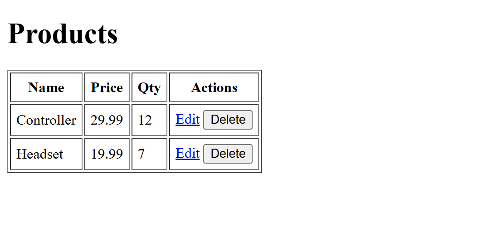
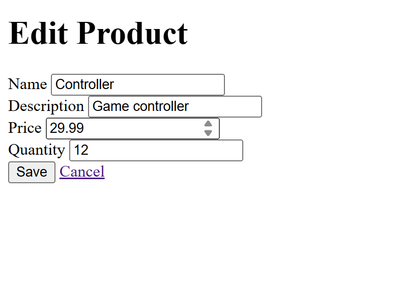
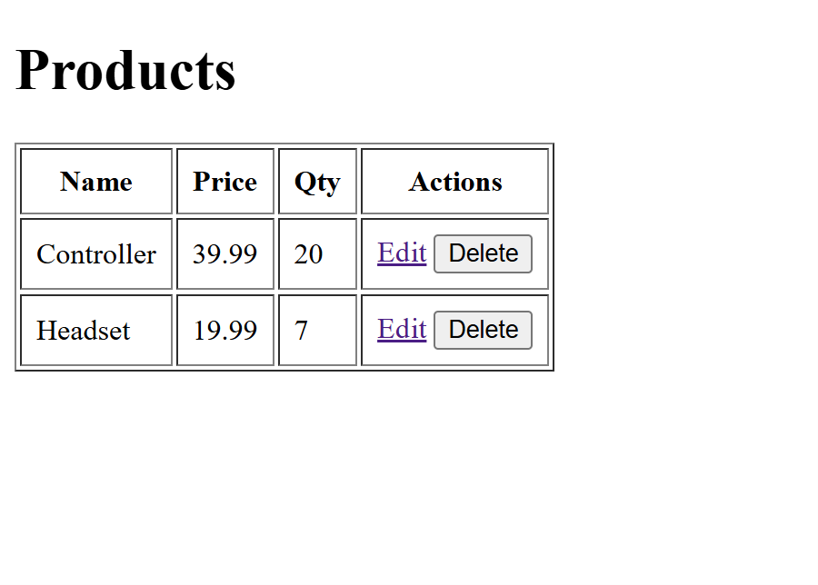
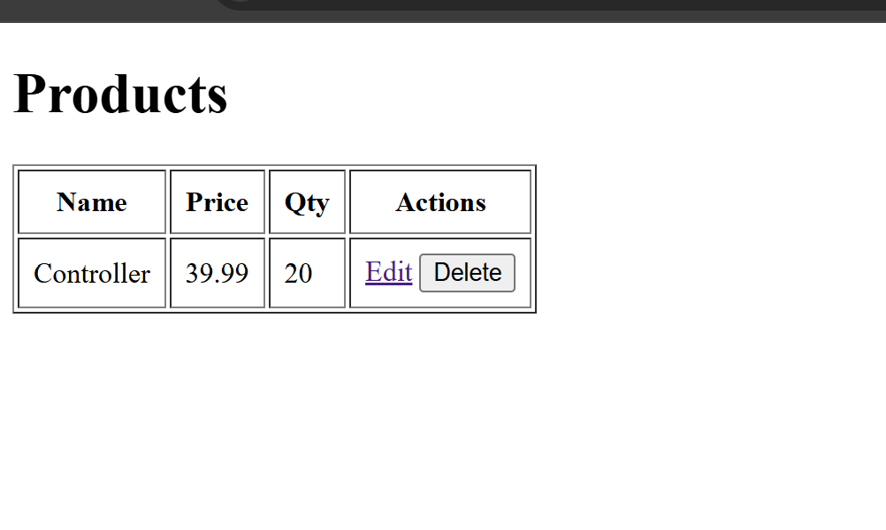
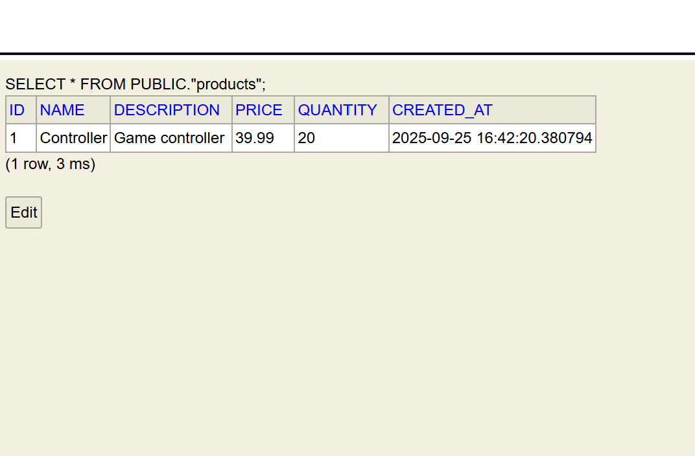

**Name:Devin Puckett**  
**Course:Cst-339**  
**Date:09/25/2025** 

**Professor:Bobby Estey**

---

## - Shows Product Page

When I go to the root URL, it immediately sends me to the products list. I added a tiny controller that does a redirect so the blank home page does not show. This proves routing is set up and the app starts cleanly. It also removes the whitelabel page at the root. This page shows every product from the database. I display name, price, and quantity in a simple table. The Edit link opens the edit form for that row. The Delete button posts to the server and then refreshes the list so I can see the change.
---

## - The Edit Page

This is the edit screen for one product. The form is prefilled with the current values. When I hit Save it sends a post to the update endpoint and then redirects it back to the list. I added basic checks so price and quantity cannot be negative. 
---

## - Shows The Edit Implemented

This screenshot shows the Editing of a product. Here I click the Edit button for a product. It submits a small form to the edit endpoint. The item is then edited to whatever we needed to change it to from the database, and I am returned to the list view. This confirms the edit flow works end-to-end.
---

## - Showing Delete Product Implemented

This screenshot shows the deletion of a product. Here, I click the Delete button for a product. It submits a small form to the delete endpoint. The item is removed from the database, and I am returned to the list view. This confirms the remove flow works end to end.
---

## - Showing H2 Console

This is the H2 console that comes with Spring Boot. I open it at the h2-console path and connect using the in memory url and the user sa. Seeing this page means the app started and the database is reachable. I use it for quick checks while developing. Here I ran a select from the products table. It shows thselection that are currently in the database along with the created time. This matches what I see on the products page, so I know my schema and data are correct. It also proves edits and deletes are really happening in the database.
---

## - Conclusion
In this Milestone, we got the Product Display, Edit/Update, and Delete features working end-to-end. I added simple MVC pages plus controllers, and wired them to a ProductService that does basic checks like name required, price and quantity not negative, and sets createdAt. The data layer uses Spring Data JDBC with an H2 database; schema.sql builds the table and data.sql seeds it, and I verified changes in the H2 console with SELECT * FROM products.  Delete is a POST form, and both edit and delete redirect back to the list so you can see the result right away.
---
